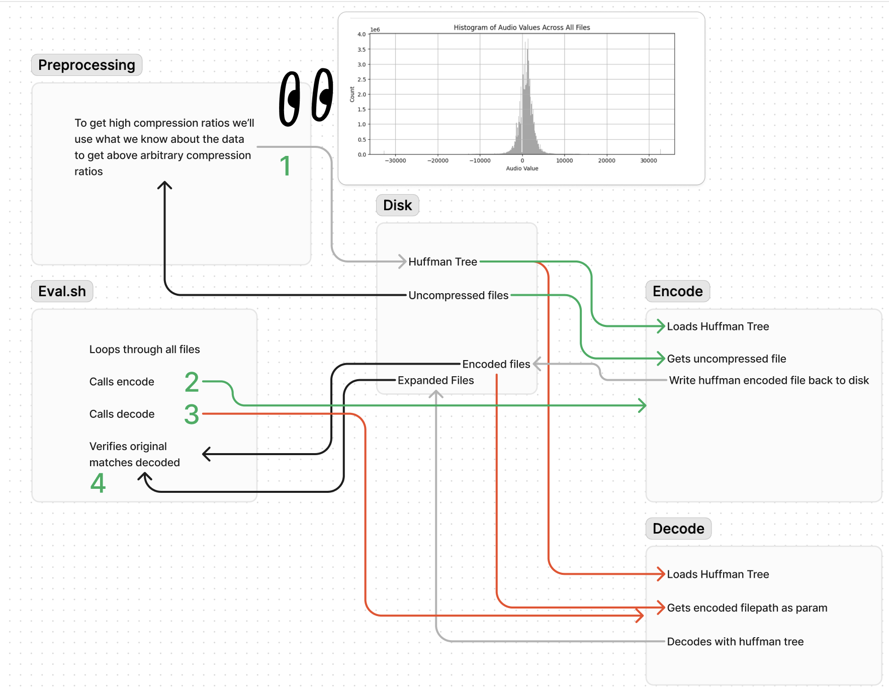

# Neuralink Compression:

# Day 4 2.85x with bigrams!

Bigram Compressors!
At the end of day 2, I noted that we probably don't need a neural network, and we can probably do sequence prediction fairly well with only a single value.

This encodes all values to 10 bits as there are only 1024 unique values in this dataset.
Then it builds a bigram model of these values.

To get started go to the getting started section at the bottom.

If you look in figma

# Day 2 and earlier

## 2.54 with Optimal Huffman Coding,

## and 2.268 or .6% better than zlib with one hop look up,

## 10x compression with some GPUs, data and a dream

This work and readme is based off of my last 48 hours of learning C++ and compression for the first time in 8 years, exploring the data, and my last two years off and on doing seizure prediction with iEEG data at the Northeastern Wireless Networks and Embedded Systems Lab resulting in a couple papers.

Please note, that all of this was done in under 50 hours.
So bear with me, it is rough around the edges.

In this readme, you'll learn the following.

1. How I got a score of 2.54 with huffman coding,
2. Why you won't be able to use that at neuralink.
3. How I built a slightly smaller in scope algorithm and combined it with zlib to beat the default zip performance which hopefully will top the leaderboards once I go and implement it in c++.
4. How I explored the data both in jupyter notebooks and when staring at the raw binary, which hopefully will serve as a foundation for future compression work.
5. I will explain with a proof why lossless 200x compression is impossible with this dataset.
6. I will explain how you can get to significantly higher compression ratios if you provide further data and/or allow some level of lossiness.
7. Finally, I will explain how I would attempt to solve this problem if I was working at neuralink and had full access to your data and ML infra based on my last two years of working with similar data and ML pipelines. (iEEG seizure prediction) I outline in this section how you theoretically could at least get to 10x compression with GPUs data and some luck
8. Why you should please, please please hire me. Although maybe for ML on embedded systems rather than as a C++ embedded dev.

## Understanding the data and compression

Most likely, neither I nor anyone else in this challenge will invent an entirely new general compression algorithm. Any performance gains we make will be from finding abnormal structure in the data, then building a compression algorithm that abuses that structure in a way that allows us to get significantly higher compression ratios than you would from a completely general algorithm.

You can see how I initially explored the data in [playground.ipynb](https://github.com/dschonholtz/neuralink/blob/main/playground.ipynb)

Here are some basic stats:
743 monochannel WAV files all sampled at 19531 Hz

The data type is int16 with values ranging from -32768, 32767 (the max vals for int16s)

The smallest non-zero step size between two consecutive values is 63.

This is our first big hint, that screams a power of 2 and that maybe we can shave off 6 bits on every single value. 2^ 6 = 64

If we plot the histogram of all possible values we learn a lot!
The values are in an approximate normal distribution, and the vast majority of them are clustered. This is good! More structure = higher compression.

As we look closer though it is a bit concerning that the data is not as normal as we would ideally like, and the distribution is wider than we would like. Ideally, we'd have 90+% of the signals in just 5% of the values.

Instead we see:

    75% of the data falls between -801.0 and 2658.0
    85% of the data falls between -1377.0 and 3234.0
    95% of the data falls between -2851.0 and 4643.0
    99% of the data falls between -10026.0 and 12971.0
    Total number of unique values: 1023

Part of the importance here comes from thinking about bitwise representation of numbers. If we can represent the vast majority of the numbers with fewer bits, then we should be able to generate higher compression ratios.

The difference between representing all of the data and 75% of the data is 4 bits per value. This is because 75% of the data can be represented with 4096 integers 2^12, and all of the values can be represented with 65536 values 2^16 This certainly isn't nothing, but it isn't as much as one would hope if you are trying to beat 2.2x compression.

We also could potentially really lean on the fact that there only appear to be 1023 active values that are actually used. If this is true, then we could assign a 10 bit number to each value. I have assumed for now that there may be other data outside of this distribution that are valid int16s. However, if this is fair game, you may be able to knock off 1/3 of the data before you do the rest of your compression. I'll get into later why this isn't as exciting as it might initially sound, but might give us another percent.

## Let's get into comparing algorithms

I compared huffman coding(from scratch), zip, mp3 (I know it is lossy, I was curious), FLAC, and a look up compressor (You don't recognize this name because I made it up).

I did all of this initially in python so it isn't compatible with the neuralink test suite, but I wrote my own test suite to see how we were dong. I also wrote huffman and some other stuff in C++, which was fun to learn, but I am just really slow working through C++. It is fun to viscerally see how much faster C++ is though.

I initially got these values:

| Method  | Compression Ratio | Notes                                    |
| ------- | ----------------- | ---------------------------------------- |
| Huffman | 2.54              | 15% better than zip!                     |
| Zip     | 2.2               |
| Mp3     | 9.535             | Compression is ez if you can delete data |
| FLAC    | 1.489             |
| Look Up | 2.268             | (More on this later)                     |

Let's back up a second, and explain why I chose Huffman, what it does, and why I thought it might do well here. Then we'll explain why this might be too good to be true.

Huffman, encodes common values via a tree with smaller binary representations.
This means that your most common values take the least bits. This is good, because as we saw in our distribution of data, we have a lot of common values!

In my implementation in python, I built an optimal huffman tree for each 5 second data source individually. This meant that every piece of data had a representation in the huffman tree, and that nothing else did.

The obvious problem there, that I didn't realize until after implementing it, is that this means that if you must decode in a separate place from where you encode, you either have to have a common pre-determined tree, or you must transmit the entire tree! The common tree is viable, but will be large!

So I attempted to build a huffman implementation that is based off of the entire distribution of all of the data, and found that this of course is outperformed by zip by decent margin. This makes sense when we peak under the hood at the zip algorithm, DEFLATE. DEFLATE uses huffman trees and combines it with a form of run length encoding to get such a good general performance.

I was almost ready to give up, but then I was briefly looking at the raw binary and saw the sinusoidal pattern you normally see in EEG data.

    0000001010100000
    0000001111100000
    0000011011100001
    0000001111100000
    0000000101011111
    0000001001100000
    0000001001100000
    0000000100011111
    0000000111011111
    0000001100100000
    0000010000100000
    0000001010100000
    0000000111011111
    0000000110011111
    0000000001011111
    0000000000011111

This rough pattern goes on for varying lengths.

But my thought is that any individual value seems to only either go up, down or repeat the same value.

The thought is there is a chance, that we can store a look up table for each individual value that corresponds to a small subset of values. That is much more efficient than you would get from a general algorithm.
As if you can represent 32 possible next values, then you only need
5 bits to do that.

So I built a look up algorithm that naively looks at the current value, and then looks at the most common next possible values for that now previous value. If it exists we just need to transmit this smaller bit string representing the position in common next values for the current value. If it doesn't we can transmit the entire normal value.

I add a bit in front of this bit string to signify if it exists or not in the look up table. Then I tested look up tables for each value of length 32, 64, 128 and 256.

128 consistently won with a compression ratio of 1.91, something ok, but not incredible.

However, this data compression is likely to still be highly compressible by other methods.

So then we combine that with zlib again.

That gets us to a whopping 2.268. Or about 0.6% improvement over zlib. This is a technical improvement, but not by much.

We can potentially adjust the look up table to be for pairs, but that starts to look like the combination of run length encoding paired with huffman coding which of course is what zip does. Another thing we could do is to use the fact that we only see 1023 unique values in this dataset. Then for all of the cache misses, we could at least still encode the missed values as 10 bits instead of 16.

I did the math on that though, and we hit the look up table successfully 96+% of the time with a look up table of 128 values for every value seen. This means that only for four percent of values have cache misses and would benefit from the remove 6 bits. But that still would be about 1/3 of that 4%. Removing another 1.33% before going to zlib. If you want to do that I will happily take a PR.

## What is next?

So after experimenting... Let's take a step back and look at what is even possible given this dataset.

Let's look at these requirements again and see if we can identify anything else that might be making this harder than it needs to be.

1 ms latency and 20khz with 200x compression.

Well in a ms we only get 20 samples of 10 bits each.
This means that the at 200x compression each sample must be compressed to a single bit.

That is trivially impossible as any data that is out of distribution no matter how much you know about the previous data obviously cannot be compressed to a single bit.

So with this dataset that is impossible, but how far could we get with a better dataset? Could we do better? For instance, if we get 1000 channels at once, could we compress across channels?

I looked at the EDF EEG dataset here: https://physionet.org/content/chbmit/1.0.0/

I also have access to iEEG data, but cannot share it due to IP concerns, but if you are interested, you can read or get the data yourself from epilepsae: https://www.ncbi.nlm.nih.gov/pmc/articles/PMC3296971/. I am also working on a data pipeline for EDF EEG scalp data and that data is open source and from MIT so we can look at that.

We can see that different channel have between 1 and 5% overlap with other channels generally. 6 of the 23 channels had overlap of > 3%. This is significantly higher than you would expect for the int16 values, but when looking at the distribution of data, we can see that it is just a much smaller range and this largely entirely explains the overlapping values.

The naive interpretation of this suggests, at least for the scalp EEG dataset, the values are not strongly correlated, and to know if we could further compress data with correlation between neighboring signals, we would have to look directly at the full neuralink dataset which has not been provided, but it does not look particularly promising given these preliminary results from the EDF dataset.

# This problem doesn't seem tractable. How do we solve it anyway?

So far, we have learned a lot, but haven't made much headway. How could we make progress? There are two options I can think of with neural networks.

1. Do the compression and to accept some loss with an auto encoder esque architecture.
2. Do next signal prediction with a neural network and do error correction on chip before sending the result. Use the same neural network on the receiver to reproduce the values.

The neuralink team probably doesn't want to do option 1 because they do not want to build a compression algorithm that drops data that their ML team might otherwise be able to use, but the ML team is likely compressing this data in their model anyway for specific tasks. So perhaps there is a world where you build an auto encoder and the ML team trains all of their models on top of that directly and everything is ok.

On top of this, in academia, this exact problem, transmission being too expensive, is the exact reason the lab I have worked in does the ML in chip in a patient's head rather than attempting to transmit the data to an external source. The problem is, since neuralink presumably wants to do arbitrary data processing with this data, you need to be able to transmit it all somewhere else. Training a model to do compression or arbitrary other tasks in the patients skull has other problems too. The data often needs to be trained per person, it is hard to do transfer learning well between patients, but it still at least appears to be possible.

The solution most likely looks like an auto encoder network as pictured below.

You train a network on a massive amount of raw data that has a very highly compressed latent representation of that data and then the network expands that back out into an image or in this case the matrix of 1024 sensor outputs.

What is tricky about this, is that this is closer to video, so the auto encoder architecture likely needs to be closer to a vision transformer architecture or a series of 1d CNNs/LSTMs or transfomers that are then fed into a fairly normal auto encoder. To learn how to actually do this well would require reading a lot of papers on video auto encoders and do further analysis on the architecture, size and if the models can be quantized down onto a chip like the one in the neuralink.

The problem I expect you would run into, is even after aggressively pruning and quantizing the model, you still can't realistically fit it on your chip.

So what you might end up doing is for a single neuron at a time or for a group of them just attempt to predict the next value in the time series data.
This model could be very small, and be run on a chip like the neuralink, although an embedded GPU would help, and could be accurate judging by our seizure prediction results: https://arxiv.org/abs/2401.06644

## The 10x compression stuff

This takes us to option two. Next signal prediction at BOTH the receiver and transmitter. What would be ideal, is to do error correction on chip before transmission. Given a channel's history, the neural network predicts a value 0-1023, that is confirmed as the correct value, and then the value is simply dropped. If the value is not correct, the chip transmits the entire value.
Then you would only have to transmit the values and the locations in the array where the value is not correct, then on the receiver, you would run the exact same model to decompress everything except for the values you transmitted.

The problem with any embedded neural network here will probably be network size. You probably won't even be able to predict 1024 values, but you could probably predict 128, and as saw earlier that has a hit rate of 96%.

So if you could have a neural network that predicted the next signal ~85% of the time. You compress the remaining bits down to 10 bits each you actually would be at a lossless 10x compression.
You could probably juice those numbers a bit too for when the network was wrong, but it's second or third choice was correct you could transmit a small number of bits to signify what place in the networks output it was.

Something like:

    0 bits if network gets it right.
    4 bits if the network was wrong but the correct choice was in the top 16 it predicted.
    7 bits if it is somewhere else in the top 128
    10 bits if the network was just wrong completely.

You would have some overhead, but this starts to feel doable. Especially since you could probably run the network even on a CPU with a batch size of 32 or 64 very quickly so doing 16 batches of 64 for all 1024 neurons might be possible even with the crazy latency requirements described.

We experimented with a bunch of loss functions and model architectures and the 1D CNN with a focal loss function performed the best for seizure prediction for a single channel and I'm guessing it may perform well in predicting the next value for a stream as well.

The problems here come back to being patient specific, and having to train a new model for each patient, but maybe this could be overcome with transfer learning, hence my not giving you an implementation right now.

If you gave me data and some GPUs then I'd love to give it a whirl though. I'll also run this by my lab and see if I can do this in parallel with the data pipeline stuff I'm currently working on.

## Wait do we we need the Neural Net? (Requirements and complexity are bad)

Training neural networks is time consuming error prone, and potentially faulty.
In the look up compressor, we already have the probability distribution of the potential next values. A time series neural network would probably do better, but the idea of we can send less bits for common next values hasn't been fully squeezed yet and is still notably distinct from general common sequence matching in run length encoding or in huffman.

So let's go back to our jupyter notebook, load up the generated lookup_table.npy file that Lookup compressor generated and then we can calculate what the optimal window size is and how to send less bits.

The idea is the optimal window size may be 128, but maybe if in the value is in the top 4 common positions we only send 2 bits to signify that.

So something like:

Break potential outputs into 4 sections.

1. The result is in the top 8 results
2. The result is in the top 32 results
3. The result is in the top 128 results
4. The result wasn't in the top 128

We then can transmit 2 bits to signify which category it is in. Then:

    3 bits for category 1
    5 bits for category 2
    7 bits for category 3
    10 bits for category 4

Looking at a quick notebook calculation:

    Top 1 positions: 16.53% of values
    Top 2 positions: 28.04% of values
    Top 4 positions: 44.58% of values
    Top 8 positions: 65.84% of values
    Top 16 positions: 88.07% of values
    Top 32 positions: 99.61% of values
    Top 64 positions: 100.00% of values
    Top 128 positions: 100.00% of values

# Getting Started

    python3 -m venv venv
    source venv/bin/activate
    pip install -r requirements.txt
    cp data.zip Neuralink/

    # if you have the data files
    cp bigram_model.pkl Nueralink/
    cp lookup_tables.pkl Neuralink/

    # if you want to generate them yourself
    unzip data.zip
    python3 python_play/BiGramCompressor/Tokenizer.py
    python3 python_play/BiGramCompressor/BigramModel.py test
    # The test command will build the bigram model and run one of the wav files through

Or you can just look in the python notebooks

If you want to visualize the uml diagrams explaining the bigram compressor
Install the PlantUml extension Then you have to adjust the settings.
I am using the remote server in their settings.

# Appendix

Figma for where I am doing some design like the above.

https://www.figma.com/board/heWNpubt54RsLYn13DYlH5/Untitled?node-id=0-1&t=CfNTYalkSzWcyR8q-1
